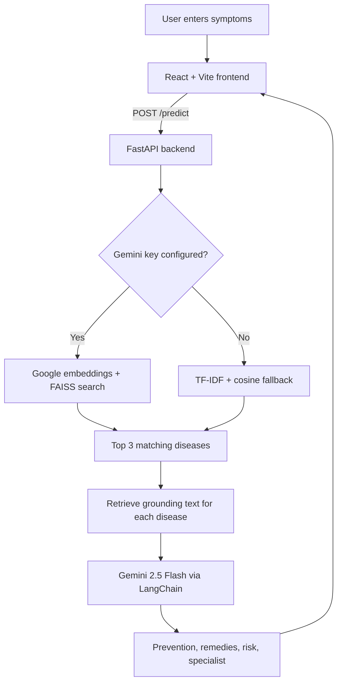

<div align="center">

#  AURA

### AI-Driven Disease Prediction & Guidance Platform

**Predict • Understand • Prevent**

A full-stack health companion that matches your symptoms against a Mayo Clinic–derived disease dataset using **semantic search**, then uses a **RAG pipeline with Google Gemini** to generate prevention tips, home remedies, a risk level, and a specialist recommendation.

<br/>

<a href="https://disease-predictor-tan.vercel.app/">
  
</a>
<a href="https://github.com/DristiLaskar/AURA">
  
</a>

<br/><br/>


</div>

---

## Overview

**AURA** turns a list of symptoms into structured, easy-to-read health information.

1. **Match** – Your symptoms are compared against **1,167 conditions** using Google embeddings and a **FAISS** vector index (with a TF-IDF + cosine fallback that works offline).
2. **Ground** – For each of the top 3 matches, the disease's own source text is retrieved from the dataset (**RAG**).
3. **Enrich** – **Gemini 2.5 Flash**, via LangChain, uses that text to write prevention tips, safe home remedies, a risk level, and a recommended specialist.
4. **Present** – A React interface shows the results alongside an animated, cursor-aware **AURA assistant** drawn on HTML Canvas.

> **Disclaimer:** AURA is for educational and informational purposes only. It is **not** a substitute for professional medical diagnosis, treatment, or emergency care. If you think you are having a medical emergency, contact your local emergency services.

---

## Features

**Backend**

- **Semantic symptom matching** – Google `embedding-001` + FAISS, so synonyms such as "high temperature" and "fever" match.
- **Offline fallback** – Without an API key the backend still works, using cleaned TF-IDF + cosine similarity and generic guidance.
- **Data cleaning** – Roughly 39% of the scraped rows contained page boilerplate (newsletter, privacy, and form-error text). It is stripped before anything is embedded.
- **Grounded RAG enrichment** – Gemini is given the disease's own reference text instead of answering from the name alone.
- **Persistent enrichment cache** – Generated guidance is saved to disk, so repeat lookups are instant and cost no extra API calls.
- **API hardening** – Input validation, a per-IP rate limit (20 requests per 60 seconds), and configurable CORS origins.

**Frontend**

- **Symptom chips** – Add symptoms by typing (Enter to add) or by tapping quick suggestions.
- **Top 3 results** – Selectable cards, each with a risk badge (Mild, Moderate, or Severe).
- **Detail view** – An explanation from AURA, prevention tips, home remedies, a risk meter, and a recommended specialist.
- **Find a nearby doctor** – Opens Google Maps for the recommended specialist, using your device location or a city you type.
- **Interactive AURA assistant** – A canvas-drawn character with cursor-tracking eyes, blinking, and a "thinking" state, rendered at a throttled ~30 FPS.
- **Resilient UI** – If the backend can't be reached, the interface shows built-in demo results instead of breaking.
- **Responsive** – Works on desktop and mobile.

---

## How It Works



Without a `GEMINI_API_KEY`, the Gemini step is skipped and generic default guidance is returned for each match.

---

## Tech Stack

| Layer | Technologies |
| --- | --- |
| **Frontend** | React 19 · TypeScript · Vite 7 · Tailwind CSS 4 · TanStack Router · Framer Motion · Radix UI · Zod · Lucide icons |
| **Backend** | Python · FastAPI · Uvicorn · Pydantic · python-dotenv |
| **Retrieval & ML** | Google embeddings (`embedding-001`) · FAISS · scikit-learn (TF-IDF fallback) · pandas |
| **Generative AI** | Google Gemini (`gemini-2.5-flash`) · LangChain |
| **Deployment** | Vercel (frontend) · Render (backend) |

---

## Project Structure

```text
AURA/
├── README.md
│
├── backend/
│   ├── server.py              # FastAPI app: GET /, POST /predict, CORS, rate limiting
│   ├── ml.py                  # Data cleaning, embeddings + FAISS search, TF-IDF fallback, RAG retriever
│   ├── rag.py                 # LangChain + Gemini enrichment chain with on-disk cache
│   ├── build_index.py         # One-time FAISS index builder
│   ├── requirements.txt
│   ├── .env.example
│   ├── BACKEND_CHANGES.md     # Notes on the Flask -> FastAPI rebuild
│   └── Databases/
│       ├── final_diseases_with_symptoms_enhanced.csv   # Dataset used at runtime
│       ├── prefinal_diseases_with_symptoms_enhanced.csv
│       ├── diseases_with_symptoms.csv
│       └── new_mayo_clinic_diseases.csv                # Earlier stages of the dataset build
│
└── frontend/
    ├── index.html
    ├── package.json
    ├── vite.config.ts
    └── src/
        ├── start.tsx                  # App entry (router + query client)
        ├── styles.css
        ├── routes/
        │   ├── __root.tsx             # Root layout, 404 and error boundaries
        │   └── index.tsx              # Main page: symptom input, results, doctor search
        ├── components/
        │   ├── AuraAssistant.tsx      # Canvas-rendered animated assistant
        │   ├── BackgroundEffects.tsx  # Aurora orbs and grid background
        │   └── ui/                    # Reusable UI components
        └── lib/                       # API schemas and helpers
```

---

## Getting Started

### Prerequisites

- **Python 3.10+**
- **Node.js 20.19+** (required by Vite 7)
- A **Google Gemini API key** from [Google AI Studio](https://aistudio.google.com/app/apikey). This is optional for local development; see [Running without an API key](#running-without-an-api-key).

### 1. Clone the repository

```bash
git clone https://github.com/DristiLaskar/AURA.git
cd AURA
```

### 2. Backend

```bash
cd backend

python -m venv .venv
source .venv/bin/activate          # Windows: .venv\Scripts\activate

pip install -r requirements.txt

cp .env.example .env               # Windows: copy .env.example .env
# Open .env and set GEMINI_API_KEY

python build_index.py              # One-time: builds the FAISS index (needs the key)

uvicorn server:app --host 0.0.0.0 --port 5000 --reload
```

The API is now running at `http://127.0.0.1:5000`, with interactive docs at `http://127.0.0.1:5000/docs`.

> **Important:** run the backend commands from inside the `backend/` folder. The dataset and index paths are relative to it.
>
> `build_index.py` is optional but recommended. If the index doesn't exist, it is built automatically on the first `/predict` request, which makes that request slow.

### 3. Frontend

Open a second terminal:

```bash
cd frontend

npm install

# Create frontend/.env pointing at your backend
echo "VITE_API_URL=http://127.0.0.1:5000" > .env

npm run dev
```

Vite prints the local URL, which is `http://localhost:5173` by default.

> **Note:** If `VITE_API_URL` is missing or the backend is unreachable, the UI shows built-in **demo results** rather than real predictions. If you only ever see Influenza, Common Cold, and Viral Pharyngitis, check that variable and that the backend is running.

### Running without an API key

If `GEMINI_API_KEY` is not set, AURA still runs:

- Matching uses the cleaned **TF-IDF + cosine similarity** fallback.
- Each prediction gets generic default guidance (general physician, moderate risk) instead of Gemini-generated advice.

This is useful for local development and offline testing, but results are noticeably weaker than with embeddings and RAG enabled.

---

## Environment Variables

**Backend** (`backend/.env`)

| Variable | Required | Description |
| --- | --- | --- |
| `GEMINI_API_KEY` | Recommended | Google Gemini key, used for embeddings and RAG enrichment. `GOOGLE_API_KEY` is also accepted. |
| `ALLOWED_ORIGINS` | No | Comma-separated CORS origins. Defaults to `*`. In production, set it to your frontend URL. |

**Frontend** (`frontend/.env`)

| Variable | Required | Description |
| --- | --- | --- |
| `VITE_API_URL` | Yes | Base URL of the backend, with no trailing slash (e.g. `http://127.0.0.1:5000`). |

Never commit real `.env` files. They are already git-ignored, and `backend/.env.example` is a safe template.

---

## API Reference

### `GET /`

Health check.

```json
{ "status": "ok", "message": "AURA backend running" }
```

### `POST /predict`

Returns the **top 3** matching diseases with enrichment.

**Request**

```json
{
  "symptoms": "fever, cough, fatigue"
}
```

`symptoms` is a single **comma-separated string**.

**Response** *(illustrative; actual values depend on the dataset, index, and Gemini output)*

```json
[
  {
    "disease": "Common cold",
    "probability": "61.3%",
    "prevention": [
      "Wash your hands frequently",
      "Avoid close contact with sick people",
      "Get enough sleep"
    ],
    "remedies": [
      "Drink warm fluids",
      "Rest and stay hydrated"
    ],
    "specialist": "General Physician",
    "risk": "Mild"
  }
]
```

| Field | Type | Description |
| --- | --- | --- |
| `disease` | string | Condition name from the dataset |
| `probability` | string | Similarity score shown as a percentage (see [Limitations](#limitations)) |
| `prevention` | string[] | 3–5 short prevention tips |
| `remedies` | string[] | 2–4 safe home remedies for mild symptoms |
| `specialist` | string | Suggested type of doctor |
| `risk` | string | One of `Mild`, `Moderate`, `Severe` |

**Status codes**

| Code | Meaning |
| --- | --- |
| `200` | Success |
| `400` | No valid symptoms provided |
| `422` | Invalid request body |
| `429` | Rate limit exceeded (20 requests per 60 seconds per IP) |

**Try it**

```bash
curl -X POST http://127.0.0.1:5000/predict \
  -H "Content-Type: application/json" \
  -d '{"symptoms": "fever, cough, fatigue"}'
```

---

## Dataset

The dataset was built from Mayo Clinic's A–Z disease listings.

| Property | Value |
| --- | --- |
| Conditions | 1,167 |
| Columns | `Letter`, `Disease Name`, `URL`, `Symptoms`, `IsRare` |
| Rare conditions | 230 flagged with `IsRare = 1` |
| Runtime file | `backend/Databases/final_diseases_with_symptoms_enhanced.csv` |

The other CSVs in `Databases/` are earlier stages of the build (disease list, then scraped symptoms, then the rare-disease flag). At startup, each row's symptom list is cleaned, and short symptom-like lines are kept while headers, long narrative paragraphs, and boilerplate are dropped. Each disease then becomes one document for embedding and retrieval.

**Generated at runtime** (git-ignored, recreated automatically):

- `Databases/faiss_index/` – the FAISS vector index
- `Databases/enrichment_cache.json` – cached Gemini output per disease

---

## Deployment

### Backend on Render

| Setting | Value |
| --- | --- |
| Root directory | `backend` |
| Build command | `pip install -r requirements.txt && python build_index.py` |
| Start command | `uvicorn server:app --host 0.0.0.0 --port $PORT` |
| Environment | `GEMINI_API_KEY`, `ALLOWED_ORIGINS=<your frontend URL>` |

Adding `python build_index.py` to the build command means the index is ready before the first request. Otherwise the first `/predict` call builds it.

### Frontend on Vercel

| Setting | Value |
| --- | --- |
| Root directory | `frontend` |
| Framework preset | Vite |
| Build command | `npm run build` |
| Environment | `VITE_API_URL=<your Render backend URL>` |

`VITE_*` variables are baked in at **build time**, so redeploy the frontend after changing `VITE_API_URL`.

---

## Limitations

- **Not a diagnosis.** Predictions are similarity matches against a text dataset, not clinical reasoning.
- **The "probability" is a similarity score,** not a calibrated medical probability. With embeddings it is derived from vector distance (`1 / (1 + distance)`), and with the TF-IDF fallback it is cosine similarity. Scores across different queries aren't comparable, and the three shown do not sum to 100%.
- **Generated guidance can be wrong.** Gemini output is grounded in the retrieved text but is not medically reviewed.
- **Coverage is limited** to the conditions in the dataset.
- **Rate limiting is in-memory,** so it resets on restart and isn't shared across multiple server instances.

---

## Future Scope

- Voice-based symptom input
- Multi-language support
- Personalized health history and symptom timeline tracking
- Structured symptom extraction from free-text descriptions
- Nearby doctor and specialist discovery inside the app
- Wearable health-data integration

---

## Contributing

Contributions, suggestions, and improvements are welcome.

```bash
git clone https://github.com/DristiLaskar/AURA.git
cd AURA
git checkout -b feature/your-feature
```

Make your changes, then open a pull request.

---

<div align="center">

### Built with React, FastAPI, FAISS, LangChain & Gemini

**AURA — Turning symptoms into understandable health insights.**

</div>
